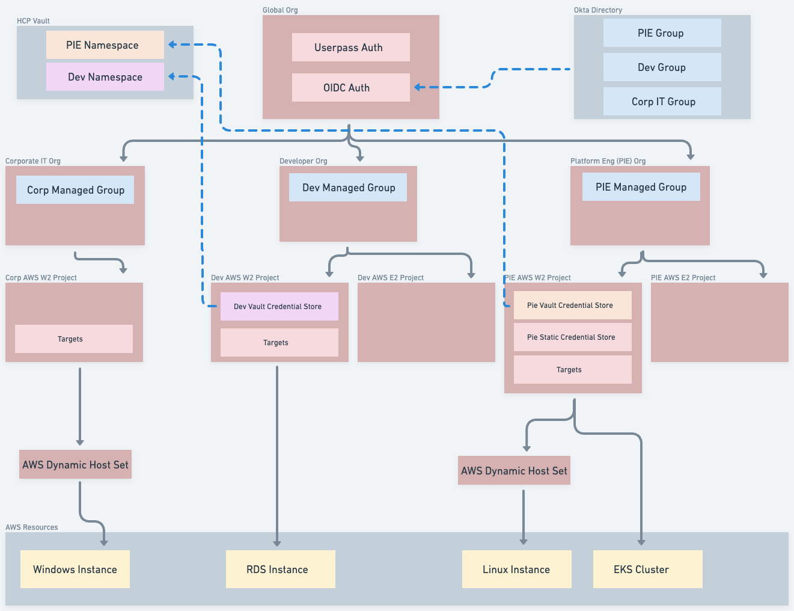
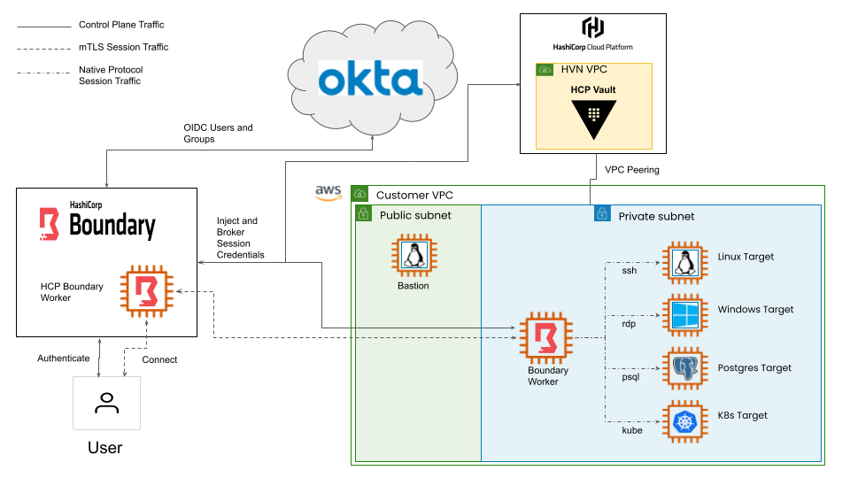

# Boundary Demo

## Demo Environment
This terraform code builds an HCP Boundary enviroment that inclues connectivity to HCP Vault for credential brokering and injection, Okta integration for OIDC authentication and managed groups, and a number of AWS resources that are used as workers and Boundary targets.  

### Features
- SSH with Vault generated SSH Certificates and username templating
- RDP Target with brokered AD credentials from Vault LDAP Secrets Engine
- Okta integration using managed groups with different targets for each group
- Session Recording
- K8s target with brokered credentials from Vault K8s Secrets Engine
- Database target with brokered credentials from Vault DB Secrets Engine
- Multi-hop using HCP ingress worker and private egress worker

### Boundary Organization Structure

### Demo Environment Diagram

### Components
| Component | Purpose |
| ----------- | ----------- |
| HCP Boundary | Boundary Control Plane |
| HCP Vault | Boundary Credential Store |
| Boundary Worker | Boundary EC2 Worker |
| Okta | OIDC Authentication |
| EC2 Linux Instance | SSH Cert Auth Target, Postgres Target, K8s Target |
| EC2 Windows Instance | RDP Target |

## Setup

This video walks through setting up most of the pre-requisites and building the environment: https://www.youtube.com/watch?v=k1ioZtfEXkk

### Prerequisites
**HCP Account**

You will need an account on the Hashicorp Cloud Platform to create the Boundary and Vault clusters.  Sign up for an HCP account here:  https://www.hashicorp.com/cloud.  You will also need to create a Service Principal and Service Principal keys.  The documentation for creating a Service Principal is here:  https://developer.hashicorp.com/hcp/docs/hcp/admin/iam/service-principals.  **The Service Principal should be created at the Organization level rather than the project level.**  

**Okta Developer Account**

You will need an Okta developer account to fully utilize this demo.  You can sign up for an account here: https://developer.okta.com/signup/
Once logged in you will need to create an API token.  The process for creating an API token is here:  https://developer.okta.com/docs/guides/create-an-api-token/main/#create-the-token.  Be sure to save the token as you will need it later.  

**A Variable Set with AWS credentials**

You will need a pre-existing variable set with AWS credentials that have appropriate permissions to deploy the various resources.  If you are a Hashicorp employee with an SE demo account then you can use doormat to generate these credentials and push them into the appropriate variable set.  Documentation on using doormat can be found here:  https://hashicorp.atlassian.net/wiki/spaces/SE/pages/1617101761/Doormat.  

**An SSH Key Pair**

You will need an SSH key pair to set up authentication to the SSH target using user provided credentials.  You may already have a public and private key pair (generally id_rsa.pub and id_rsa) in the .ssh folder of your home directory if you are using Mac or Windows.  To create a new key pair you can use Putty or OpenSSL.  OpenSSL directions are here: https://wiki.osuosl.org/howtos/ssh_key_tutorial.html

You will use the public key as an environment variable and the private key will be used to authenticate to the SSH target later.

**The Boundary Desktop Client Installed**
You will need the Boundary Desktop Client installed to demo certain features like the integrated terminal.  https://developer.hashicorp.com/boundary/tutorials/oss-getting-started/oss-getting-started-desktop-app

**PSQL Binary Installed**
You will need the PSQL binary installed to connect to the database server using the `boundary connect postgres` command.  Install PSQL based on instructions for your speicfic OS.  

**RDP Client Installed**
You will need a Remote Desktop Protocol client installed to connect to the RDP targets.  On Windows sytems this is installed automatically but Linux or Mac users will need to install a RDP client.  

### Workspaces and Variables
This repo was built to run on Terraform Cloud or Enterprise.  It uses the tfe_outputs data source to pass parameters between the boundary_demo_init workspace and other workspaces.  If you want to run this locally you will need to modify the code to use cross state sharing to populate those values.  

The ***providers.tf*** file in each workspace includes a cloud block that targets a TFC/TFE organization.  You will need to update this block to reflect your TFC/TFE org name.  

This repo consists of four modules:
 
**boundary-demo-tfc-build** - This module is run using local terraform execution and build the boundary-demo-init and boundary-demo-targets workspaces in TFC/TFE

**boundary-demo-init** - This workspace builds an HCP Boundary cluster and HCP Vault cluster along with an associated HVN for the Vault cluster.  

**boundary-demo-targets** - This workspace does the bulk of the work, building out all of the Boundary and Vault configuration as well as the AWS components used as workers and targets.

**boundary-demo-ad-secrets** - This workspace configures the Vault LDAP secrets engine to generate dynamic AD credentials on the windows target and brokers those credentials to the it-rdp-target-admin Boundary target.

The following variables need to be set in the *boundary-demo-tfc-build* module.  These variables will be propogated into the TFC/TFE workspaces built by that module.  

| Variable | Type | Sensitive | Purpose |
| --------- | -------- | -------- | -------- |
| **organization** | terraform | No | The TFC/TFE Organization Name |
| **boundary_user** | terraform | No | The username the default admin user created in the HCP Boundary Cluster |
| **boundary_password** | terraform | Yes | The password of the default admin user created in the HCP Boundary Cluster |
| **region** | terraform | No | The AWS region into which to deploy the Hashicorp Virtual Network and AWS resources |
| **okta_baseurl** | terraform | No | The base url of the Okta organization to use for OIDC integration.  Usually okta.com |
| **okta_org_name** | terraform | No | The organization name of hte OKta organization to use for OIDC integration i.e dev-32201783 |
| **okta_user_password** | terraform | Yes | The password to set on the Okta users created and added to the Boundary application |
| **admin_pass** | terraform | Yes | The password to set for the Administrator account on the Windows target |
| **public_key** | terraform | No | The SSH public key to set on the AWS EC2 instances as the default login |
| **aws_varset** | terraform | No | The name of a pre-existing Variable Set that contains AWS credentials set as environment variables |
| **OKTA_API_TOKEN** | environment | Yes | The API token used to authenticate the Okta provider |
| **HCP_CLIENT_ID** | environment | Yes | The Client ID used to authenticate the HCP provider.  This should be linked to an Organization level Service Principal |
| **HCP_CLIENT_SECRET** | environment | Yes | The Secret Key used to authenticate the HCP provider |

It is recommended that you pass any variables marked sensitive as environment variables or through CLI flags.  

### To Build
- Push credentials from doormat to your AWS variable set

    - `doormat aws tf-push variable-set --id <variable set id> --account <aws_account_name>`
    
- Set the non-sensitive variables for the *boundary-demo-tfc-build* module in a terraform.tfvars file.  
- Set the sensitive variables as environment variables. 

    - For example:

    - `export TF_VAR_HCP_CLIENT_SECRET=123456789`
- Update the **cloud block** in the providers.tf file in the *boundary-demo-init*, *boundary-demo-targets*, and *boundary-demo-ad-secrets* workspaces to reflect your TFE/TFC organization name.  
- Once all variables have been set, perform a terraform init and apply on the *boundary-demo-tfc-build* module.  

    - `boundary-demo-tfc-build % terraform init`

    - `boundary-demo-tfc-build % terraform apply -auto-approve`

    - This will create two workspaces in your TFC environment: *boundary-demo-init* and *boundary-demo-targets*.  
- Run the *boundary-demo-init* workspace first.  

    - `boundary-demo-init % terraform init`

    - `boundary-demo-init % terraform apply -auto-approve`

- Run build the *boundary-demo-targets* workspace 

    - `boundary-demo-targets % terraform init`

    - `boundary-demo-targets % terraform apply -auto-approve`
    
- Wait about 10 minutes after building the *boundary-demo-targets* workspace for the rdp-target EC2 instance to finish running it's cloudinit script which requires two reboots.  The *boundary-demo-ad-secrets* workspace run will fail if the cloudinit has not completely finished.  

- Run the *boundary-demo-ad-secrets* workspace

    - `boundary-demo-ad-secrets % terraform init`
    
    - `boundary-demo-ad-secrets % terraform apply -auto-approve`

**Important Notes**
- If you do not wish to use the Okta integration you can delete or comment out the okta.tf file from the *boundary-demo-targets* folder in the repo.  You will also need to comment out the references to the Okta provider in the providers.tf file in the *boundary-demo-targets* folder.  The pie-ssh-cert-target target will not work if you do not have Okta integration.  
- The Vault token generated by the  *boundary-demo-init* workspace expires after 6 hours.  If you get Vault errors when attemtping to rerun other workspaces then first run a fresh apply on the  *boundary-demo-init* workspace to create a new Vault token.  
- The Dynamic Host Set setup uses an IAM role and User configuration that is specific to Hashicorp Employee AWS sandbox accounts.  If used in account without restrictions on the ability to create IAM users and policies then you will want to modify the configuration at the top of the boundary.tf config file to create the required IAM user and policy directly.  
- The terraform code is generally stable and completes in a single run but if you experience issues a second run is usually enough to correct them.  
- If the self-managed worker does not come up properly or dies for some reason you can rebuild it by tainting the boundary_worker and aws_instance resources in the created in the worker.tf file and then rerunning the terraform apply on the boundary-demo-eks workspace.  

    - `terraform taint boundary_worker.hcp_pki_worker`

    - `terraform taint aws_instance.worker`

### To Destroy
Destroy the workspaces in the reverse order that you created them.  Run a `terraform destroy` first on the *boundary-demo-ad-secrets* workspace, then on the *boundary-demo-targets* workspace, then on the *boundary-demo-init* workspace and finally on the *boundary-demo-tfc-build* module.  

The TF code creates a Session Recording Bucket object in the global scope.  **Boundary does not currently support deleting Session Recording Buckets so when attempting to run `terraform destroy` on the *boundary-demo-targets* workspace TF will throw an error.**  Currently the workaround is remove the boundary_storage_bucket resource from state and then run the destroy.  

- `terraform state rm boundary_storage_bucket.pie_session_recording_bucket` 

## Connecting to Targets
### Okta Users
When using the Okta integration four users are created in your directory.  

**Passwords** - All Okta users have the same password which is the value of the okta_user_password terraform variable that you set in the *boundary-demo-tfc-build* workspace. 

| User | Okta Group | Boundary Org | Description |
| --------- | -------- | -------- | -------- |
| global_user@boundary.lab | All | All | Has rights to connect to all targets in all orgs |
| pie_user@boundary.lab | pie_users | pie_org | Has rights to connect to all targets in PIE org |
| dev_user@boundary.lab | dev_users | dev_org | Has rights to connect to all targets in DEV org |
| it_user@boundary.lab | it_users | it_org | Has rights to connect to all targets in IT org |

  

### Available Targets
| Target | Org\Project | Credentials | Description |
| --------- | -------- | -------- | -------- |
| pie-ssh-cert-target | pie_org\pie_aws_project | **Injected** using Vault SSH Cert Secrets Engine | Connects to the SSH target as the logged in username.  **Only usable when logged in via Okta as pie_user or global_user** |
| pie-ssh-cert-target-admin | pie_org\pie_aws_project | **Injected** using Vault SSH Cert Secrets Engine | Connects to the SSH target as ec2-user |
| pie-ssh-tcp-target | pie_org\pie_aws_project | User supplied ssh key | Connect using user supplied SSH key |
| pie-k8s-target | pie_org\pie_aws_project | **Brokered** SA token from Vault K8s Secrets Engine | Connect using the k8s-connect script in the scripts folder of the repo.  See video below for more info |
| dev-db-target | dev_org\dev_aws_project | **Brokered** from Vault DB Secrets Engine | Connects using credentials brokered from Vault |
| it-rdp-target | it_org\it_aws_project | User supplied username and password | Connect using Administrator@boundary.lab user and password set in admin_pass TF variable |
| it-rdp-target-admin | it_org\it_aws_project | **Brokered** from Vault LDAP Secrets Engine | Connect using username (be sure to add @boundary.lab to the end) and password provided by Vault in connection info |

### Connecting to Targets
This video walks through connecting to the various targets that are created in the demo environment.  The .14 version of the Boundary Desktop client has an integrated shell that can be used to automatically connect to SSH targets with brokered or injected credentials.  

https://www.youtube.com/watch?v=K_eBdgqwx9k